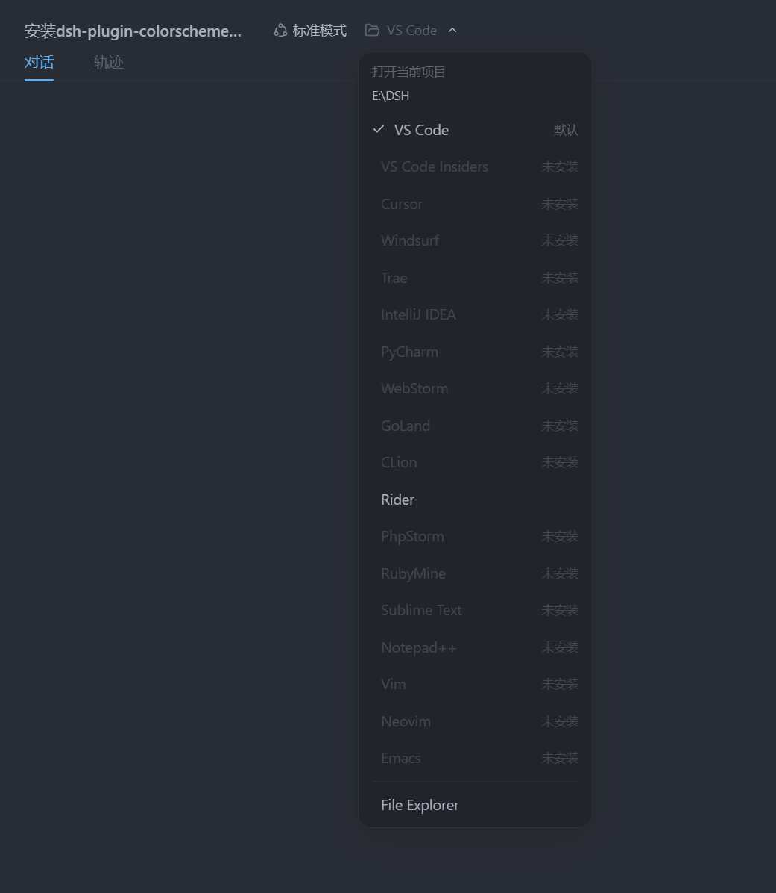

# dsh-plugin-open-editor



一键把 **当前项目** 用你喜欢的编辑器打开。插件在 DSH 会话页头的
操作区添加一个入口：

- **点击主体按钮** → 立即用默认编辑器（默认 **VS Code**）打开当前会话的工作目录；
- **点击箭头** → 弹出编辑器选择器：VS Code / Cursor / Windsurf / Trae /
  JetBrains 系列 / Sublime Text / Vim / Neovim / Emacs / 系统文件管理器等；
- 未安装的编辑器会置灰显示「未安装」；
- 打开动作发生在 **DSH 宿主机**（浏览器所在机器）上，无需浏览器具备任何 shell 权限。

## 打开文件与定位行（供其它插件复用）

`POST {routePath}` 除打开目录外，也支持**打开文件并定位到行**：

```json
{ "editor": "vscode", "path": "/abs/path/to/file.ts", "line": 42 }
```

- `path` 可以是目录或文件；带 `line` 时按编辑器的行定位方式打开：
  - VS Code / Insiders / Cursor / Windsurf / Trae：`code --goto 文件:行`
  - Vim / GVim / Neovim / Emacs：`+行 文件`
  - Sublime Text：`文件:行`
  - 其它编辑器（JetBrains 系、Notepad++ 等）：打开文件，忽略行
- 自定义编辑器模板支持 `{line}` 占位符（如 `["my-editor", "--line", "{line}", "{path}"]`），
  模板里没有 `{line}` 时忽略行参数。

> diff-review 插件的「在编辑器中打开」/「打开该行」即复用此能力。

## 安装

本仓库已包含构建产物（`dist/index.js` 与 `client.js`），可直接使用；修改过源码才需要
先执行 `npm install && npm run build`。

### 一键安装（推荐）

```sh
# macOS / Linux
bash install.sh

# Windows（PowerShell）
powershell -ExecutionPolicy Bypass -File install.ps1
```

脚本会：安装依赖（含 devDependencies，便于本地开发）→ 链接进
`~/.dsh/profiles/node_modules` → 注册 `cordis.patch.yml` → 提示重启与验证。

### 手动安装

> **用链接而不是拷贝**：`Copy-Item` 复制一份后改源码不会同步，重复安装还会
> 冲突；用下面的链接（Junction / 符号链接）指向本仓库，改源码即时生效。

```sh
# 1. 链接进 profile 依赖目录
#    macOS / Linux：
ln -sfn "$PWD" ~/.dsh/profiles/node_modules/dsh-plugin-open-editor
#    Windows（PowerShell，Junction 无需管理员权限）：
#    New-Item -ItemType Junction -Path "$HOME\.dsh\profiles\node_modules\dsh-plugin-open-editor" -Target "$PWD"

# 2. 注册到 ~/.dsh/profiles/web/cordis.patch.yml
#    - insert:
#        - id: open-editor
#          name: dsh-plugin-open-editor

# 3. 重启 dsh web
```

> 装了 pnpm 的话，也可以用 `dsh plugin --profile web add <本插件绝对路径>` 代替
> 第 1 步（等价于链接）。pnpm 未安装时先 `npm install -g pnpm`（或 `corepack enable`）。

### 验证

```sh
dsh --profile web --dump-config | grep dsh-plugin-open-editor
# 输出应包含：- id: open-editor / name: dsh-plugin-open-editor
```

重启后打开任意会话，页头标题旁会出现「在编辑器中打开」按钮。

### 开发

插件以链接方式接入 profile，改源码后：

```sh
npm run build   # 重新生成 dist/ 与 client.js
```

server 端改动需重启 `dsh web`；纯 client 端改动刷新页面即可。

## 使用

| 操作 | 效果 |
| --- | --- |
| 点击「在编辑器中打开」 | 用默认编辑器（默认 VS Code）打开当前会话的项目目录 |
| 点击右侧箭头 | 展开编辑器选择器，选择任意已安装的编辑器 / 文件管理器 |
| 菜单底部 | 显示打开结果（成功 / 失败原因） |

当前项目 = 当前会话的工作目录（`cwd`）。没有工作目录的会话不显示该按钮。

## 支持的编辑器

| 编辑器 | 探测命令 |
| --- | --- |
| VS Code | `code` |
| VS Code Insiders | `code-insiders` |
| Cursor | `cursor` |
| Windsurf | `windsurf` |
| Trae | `trae` |
| IntelliJ IDEA | `idea` / `idea64` |
| PyCharm | `pycharm` / `charm` |
| WebStorm | `webstorm` |
| GoLand | `goland` |
| CLion | `clion` |
| Rider | `rider` |
| PhpStorm | `phpstorm` |
| RubyMine | `rubymine` |
| Sublime Text | `subl` |
| Notepad++ | `notepad++` |
| Vim / GVim | `vim` / `gvim` |
| Neovim | `nvim` |
| Emacs | `emacs` |
| 系统文件管理器 | `explorer` / `open` / `xdg-open` |

> 探测依据是命令是否在 `PATH` 中。VS Code 安装后通常会自动把 `code` 加入 PATH；
> 如果提示「未找到」，请手动执行一次 **命令面板 → Shell 命令：在 PATH 中安装
> 'code' 命令**，或改用下面的自定义编辑器配置填写绝对路径。

## 配置

编辑 `~/.dsh/profiles/web/cordis.patch.yml` 中该插件的 `config`：

```yaml
- insert:
    - id: open-editor
      name: dsh-plugin-open-editor
      config:
        defaultEditor: vscode        # 点击主体按钮使用的编辑器（id）
        routePath: /open-editor/open   # 打开请求路由（一般无需改动）
        statusPath: /open-editor/editors  # 编辑器目录路由（一般无需改动）
        extraArgs: []                # 追加到每个内置编辑器命令后的参数
        allowedRoots: []             # 非空时，仅允许打开这些目录下的项目
        customEditors:               # 自定义编辑器（追加到内置列表）
          - id: my-editor
            label: My Editor
            command: ["C:\\Program Files\\My Editor\\editor.exe", "--folder", "{path}"]
```

- `defaultEditor`：主体按钮使用的编辑器 id（内置 id 见上表，也可以填自定义 id）。
- `customEditors`：`command[0]` 是可执行文件（PATH 名或绝对路径）；后面的元素按原样
  作为参数，字面量 `{path}` 会被替换为目标目录；没有 `{path}` 时自动把目录追加到最后。
- `allowedRoots`：安全开关。默认允许打开任意存在的目录（本机工具）；填写后，只有
  这些目录（及子目录）能被打开，适合把 DSH 暴露到局域网时收紧权限。
- `extraArgs`：给所有内置编辑器追加参数，例如 `["--new-window"]` 让 VS Code 总是
  新开窗口。

## 工作原理

1. 浏览器端从会话列表拿到当前会话的 `cwd`（工作目录）。
2. 点击后 `POST {routePath}`，携带 `{ editor, path }`。
3. 服务器端（DSH 宿主进程，与浏览器同机）校验 path（绝对路径、目录存在、可选
   `allowedRoots`），探测编辑器可执行文件，然后 **detached 启动**：
   - Windows：`cmd /c start "" <editor> "<path>"`（支持 `code.cmd` 等 shim，
     GUI 应用不弹控制台，vim/nvim 等控制台程序会获得独立窗口）；
   - macOS/Linux：`spawn(editor, [path], { detached, stdio: 'ignore' })`。
4. 编辑器进程与宿主解耦，宿主退出不影响已打开的编辑器。

## 卸载

1. 从 `cordis.patch.yml` 删除 `open-editor` 条目；
2. 删除 `~/.dsh/profiles/node_modules/dsh-plugin-open-editor` 目录；
3. 重启 `dsh web`。

## 常见问题

- **提示「未找到 X，请检查是否安装并加入 PATH」**：该编辑器不在 `PATH` 中。
  用 `customEditors` 配置绝对路径，或在系统里把编辑器命令行工具加入 PATH。
- **点击没有反应 / 编辑器没有出现**：确认已重启 `dsh web`，并检查设置里
  `open-editor` 插件已加载（设置 → 插件清单）。
- **我只想用 VS Code，不需要其它编辑器**：保持默认即可，箭头菜单里其它项置灰不影响使用。

## License

MIT
